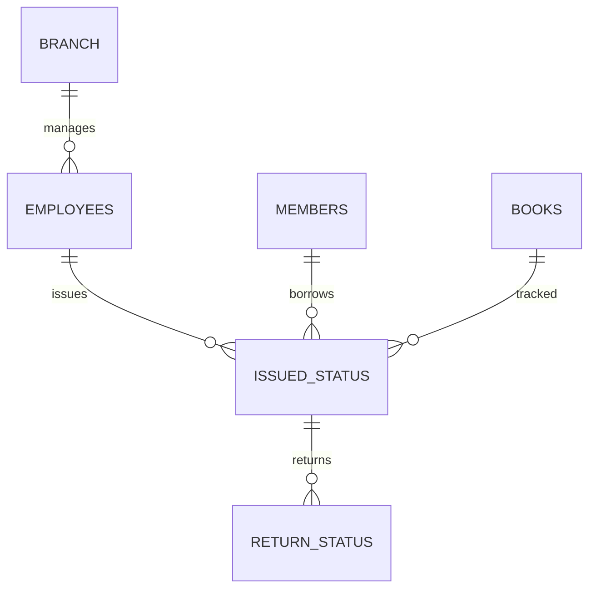

# 📚 Library Management System

<p align="center">
  <b>PostgreSQL-Based Relational Database Project</b><br>
  Designed for real-world library operations & data analytics
</p>

<p align="center">
  
  
  
</p>

---

## 🚀 Overview

A **fully structured relational database system** that models real-world library workflows including:

* 📖 Book Inventory Management
* 👥 Member Tracking
* 🔁 Issue & Return System
* 📊 Analytical Reporting

Built with a focus on **data integrity, normalization, and efficient querying**.

---

## 🎯 Key Highlights

✔️ Normalized relational schema
✔️ Strong use of foreign key constraints
✔️ Real-world SQL queries (joins, aggregations)
✔️ Business-oriented insights & reporting

---

## 🏗️ Database Architecture



---

## 🧩 Core Modules

### 📘 Book Management

* Add and categorize books
* Track availability status
* Identify high-demand books

### 👤 Member Management

* Register and manage users
* Track borrowing activity

### 🔄 Transaction System

* Issue books
* Return tracking
* Detect unreturned books

### 📊 Analytics & Reporting

* Rental revenue insights
* Frequent users detection
* Category-wise performance

---

## 🧠 Sample Queries

### 🔍 Unreturned Books

```sql
SELECT isu.*
FROM issued_status isu
LEFT JOIN return_status rs 
ON isu.issued_id = rs.issued_id
WHERE rs.return_id IS NULL;
```

### 💰 Revenue Analysis

```sql
SELECT 
    b.category,
    COUNT(s.issued_id) AS times_issued,
    SUM(b.rental_price) AS total_rent
FROM books b
JOIN issued_status s 
ON b.isbn = s.issued_book_isbn
GROUP BY b.category;
```

### 👥 Power Users

```sql
SELECT 
    issued_member_id,
    COUNT(*) AS total_books
FROM issued_status
GROUP BY issued_member_id
HAVING COUNT(*) > 1;
```

---

## ⚙️ Tech Stack

| Layer    | Technology               |
| -------- | ------------------------ |
| Database | PostgreSQL               |
| Language | SQL                      |
| Concepts | Joins, CTAS, Aggregation |

---

## 📁 Project Structure

```
library-management-system/
│── library_project_01.sql
│── README.md
```

---

## 🔮 Future Scope

* 🚀 REST API integration (Node.js)
* 🎨 Frontend dashboard (React)
* 🔐 Role-based access control
* ⚡ Stored procedures & triggers

---

## 👨‍💻 Author

**Prateek Yadav**
B.Tech CSE

---

## ⭐ Show Your Support

If you like this project, give it a ⭐ on GitHub — it helps a lot!

---
